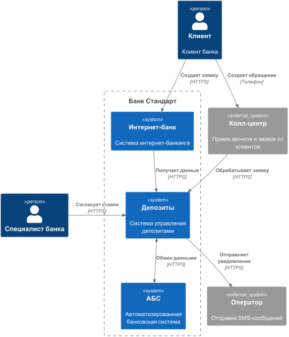
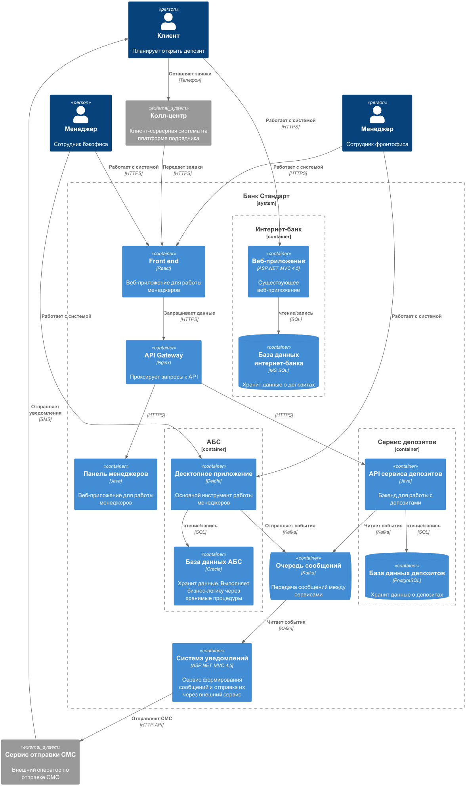

### **Название задачи:** Открытие депозитов и накопительных счетов в Интернет-банке
### **Автор:** Степанов В.
### **Дата:** 04.07.2025
### **Функциональные требования**
Депозит/накопительный счет ниже обозначается как Депозит

|**№**|**Требование**|**Действующие лица или системы**|**Use Case**|**Описание**|
| :-: | :- | :- | :- | :- |
|UC1.1||клиент, Интернет-банке|авторизация|1.клиент вводит учетные данные  2. Интернет-банке проверяет учетные данные  3. Интернет-банке предоставляет доступ с соответсвующей ролью |
|UC1.2|F1.2, F2.1, F2.2, F2.3, F2.4|клиент, Интернет-банке|подача заявки на Депозит/нак. счет|1. клиент видит доступные дерозиты со ставками (предложения)  2. клиент выбирает предложение (доступный депозит и ставку)  3. Интернет-банке отображает заявку на открытие депозита (фиксирует тип и ставку)  4. клиент вводит сумму и нажиамет подтвердит   5. Интернет-банке направлет СМС для подтверждения, ожидает ввода кода из СМС   6. клиент получает СМС и вводит код в форму, подтверждает  7. Интернет-банке проверяет код и направляет заявку в обработку, "клиенту отражается Заявка принята в обработку, ожидайте СМС с результатами"   |
|UC1.3|F4.1|Интернет-банке, АБС|передача заявки на депозит/счет|1. Интернет-банке, после подтверждения клиентом, передает в АБС заявку  2. АБС принимает заявку и предоставляет для обработки Депозитному Менеджеру Бэк-офис  |
|UC1.4| F4.1, F4.2|Депозитный Менеджер Бэк-офис(ДМ), АБС|Подтверждение депозита/счета (депозит)|1. ДМ видит список поступивших заявок  2. ДМ выбирает заявку для обработки  3. АБС отображает детали заявки Счет, Ставка, Сумма, ФИО и пр.  4. ДМ подтверждает условия  5. Открывает депозит, зачисляет средства  6. АБС отправляет СМС клиенту об открытии депозита  |
|UC2.1|F1.1, F1.3|Клиент, Сайт|подача заявки|1.Клиент выбирает стандартное предложение  2. Клиент заполняет анкету (ФИО, ТЕЛ)  3. Подтверждает отправку  3.Сайт передает данные для обработки, клиенту отображает сообщение "Ожидайте звонка"  |
|UC2.2|F1.4, F1.4|Сотрудник Колл-центра(КЦ), CRM, Клиент|Обработка заявления с сайта|1. CRM получает заявление и отображает для звонка  2.КЦ осуществляет звонок клиенту, выясняет доп информацию  3. КЦ подтверждает заявление  4. CRM передает заявку для открытия  |
|UC2.3|F1.6|Сотрудник отделения (СО), клиент, ДМ, АБС|Верификация клиента|1. Клиент приходит в Отделенеие  2.СО проверяет документы  3.СО Взаимодействует с ДМ на предмет ставки  4. СО формирует набор документов и подписывает с клиентом   5. СО подтверждает в АБС открытие депозита, прикрепляет сканы документов  6. АБС отрывает депозит  |

### **Нефункциональные требования**

| Код   | Требования                                                                                                                                                                | Комментарий  |
|-------|---------------------------------------------------------------------------------------------------------------------------------------------------------------------------|--------------|
| U     | Удобство использования (Usability)                                                                                                                                        |              |
| U1.1  | Единый дизайн для всех каналов обслуживания                                                                                                                               |              |
| U1.2  | Соблюдение корпоративных стандартов UX/UI                                                                                                                                 |              |
| U1.3  | Пользователи при работе должны видеть привычные цвета и брендированные элементы.                                                                                          |              |
| U2.1  | Предусмотреть для клиента статус зпявки на открытие депозита                                                                                                              | т.к. операция открытия депозита не быстрая - требуется информировать клиента о ее ходе и о том, что заявка не потеряна |
| R     | Надёжность (Reliability)                                                                                                                                                  |              |
| R1.1  | Команда АБС утверждает, что база данных системы уже перегружена. Онлайн-подача заявок на большое количество продуктов может поставить под угрозу работоспособность банка. |              |
| R1.1  | При этом все сервисы должны работать 24/7 и быть доступны в 99,9% случаев                                                                                                 | поэтому лучше избежать прямой работы интернет-банка с API АБС в новом процессе |
| R1.2  | Интернет-банк. в случае сбоев в ЦОД необходимо, чтобы сервисы интернет-банка были доступны и выдерживали требуемую нагрузку.                                              |              |
| R1.3  | Фактически всё работает в одном ЦОД на одной группе серверов. У банка есть резервный ЦОД, в случае сбоя можно переключиться на него                                       |              |
| R1.4  | Также лучше предусмотреть равномерное горизонтальное масштабирование и распределение запросов между серверами, приложениями и ЦОД                                         |              |
| R1.5  | Но нужно учитывать, что АБС может масштабироваться только вертикально из-за своей базы данных                                                                             |              |
| P     | Производительность (Performance)                                                                                                                                          |              |
| P1.1  | Отклик по всем операциям должен быть максимально быстрым и занимать миллисекунды                                                                                          | Сейчас с этим есть проблема: при проведении платежей некоторые справочные данные загружаются больше секунды. |
| S     | Поддерживаемость (Supportability)                                                                                                                                         |              |
| S1.1  | Реализовать отправку СМС собственными силами                                                                                                                              | текущий реализован в ядре системы |
| S2.1  | как можно больше использовать технологии, которые уже есть в банке. Например, базы данных MS SQL и Oracle.                                                                |              |
| S2.2  | Можно развернуть новые технологии, но необходимо, чтобы они были совместимы с существующими платформами разработки.                                                       |              |
| S2.4  | желательно, чтобы внутри банка уже была экспертиза                                                                                                                        |              |
| S2.3  | лучше использовать Kafka на перспективу.                                                                                                                                  | текущая версия платформы интернет-банка несовместима с ней |
| S2.4  | стоит подумать о переводе интернет-банка на микросервисную архитектуру, но пока только в рамках задачи открытия депозитов                                                 |              |
| S2.5  | нужно предусмотреть разработку документации для дальнейшего расширения системы                                                                                            |              |
| S3.1  | Снизить связанность сервисов                                                                                                                                              | Большая связанность сервисов влияет на сложность производтва и тестированя, может влиять на надежность |
| +R    | + Ограничения (Restricitions)                                                                                                                                             |              |
| +R1.1 | ФИО и Тел - персональные данные. Требуется защищенный канал                                                                                                               |              |
| +R2.1 | АБС. Доступ к данным по кредитам и депозитам должен быть разделены.                                                                                                       |              |
| +R2.2 | Требуется защищенный канал для клиента                                                                                                                                    |              |
| +R3.1 | Хранение и передача прес. данных должно быть защищено                                                                                                                     | Вводятся новые взаимодействия, сбор и передача чувствительных данных. Требуется защита согласно локальному законодательству| Вводятся новые взаимодействия, сбор и передача чувствительных данных. Требуется защита согласно локальному законодательству |

### **Решение**
### Context

### Container
