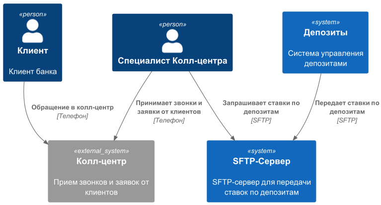
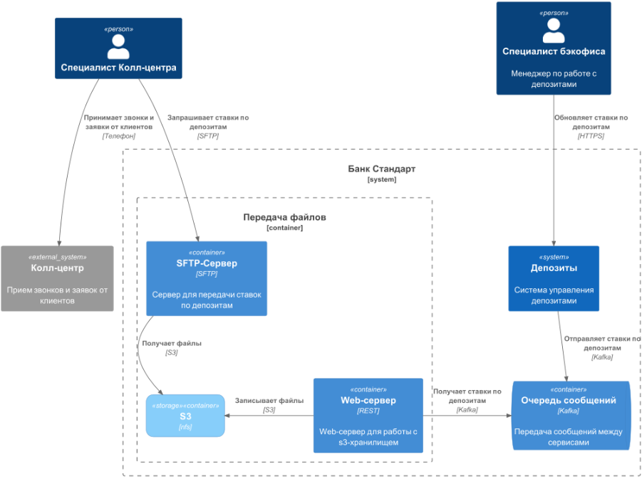

### **Название задачи:** Передача ставок в кол-центр
### **Автор:** Степанов В.
### **Дата:** 04.07.2025
### **Функциональные требования**

| **№** | **Действующие лица или системы**                      | **Use Case**                                    | **Описание**                                                                                                                                                                 |
| :---: | :---------------------------------------------------- | :---------------------------------------------- |:-----------------------------------------------------------------------------------------------------------------------------------------------------------------------------|
|       | пользователь, менеджер колл-центра, система депозитов | Пользователь обращается за актуальными ставками | 1. Пользователь запрашивает актуальные ставки в колл-центре 2. Менеджер запрашивает актуальные ставки в банке 3. Менеджер читает файл с актуальными ставками  4. Менеджер передает информацию о ставках пользователю         | | 

### **Нефункциональные требования**

| **№** | **Требование**                                                            |
| :---: | :------------------------------------------------------------------------ |
|   1   | Обмен данными возможен только через файлы                                 |
|   2   | Передача файлов должна быть по защищеным каналам связи                    |
|   3   | В колл-центре должна быть возможность получить наиболее актуальные ставки |

### **Решение**

1. Передача файлов осуществляется по протоколу SFTP из-за его безопасности и надежности.
2. Колл-центр получает доступ к актуальным ставкам во время обращения пользователя, что улучшает качество обслуживания.
3. Данные о ставках передаются через очередь сообщений и обновляются в файлах на файловом сервере с доступом по SFTP, что обеспечивает надежность и устойчивость к сбоям.
 

### **Альтернативы**

1. Можно использовать Email вместо файлового хранилища с доступом по SFTP для передачи ставок.
2. Можно реализовать дашбород с отображением даты, времени и ставок с доступом по HTTPS и персональным учетными записями.
   2.1 дашборд может читать данные из файлов сформированных ранее
   2.2 дашборд может читать данные из базы данных, вместо файлов.

**Недостатки, ограничения, риски**
1. Сотруднику колл центра необходимо настроить подключение по sftp, могут быть проблемы в настройке.
2. Возможно потребуются изменения на уровне политик windows